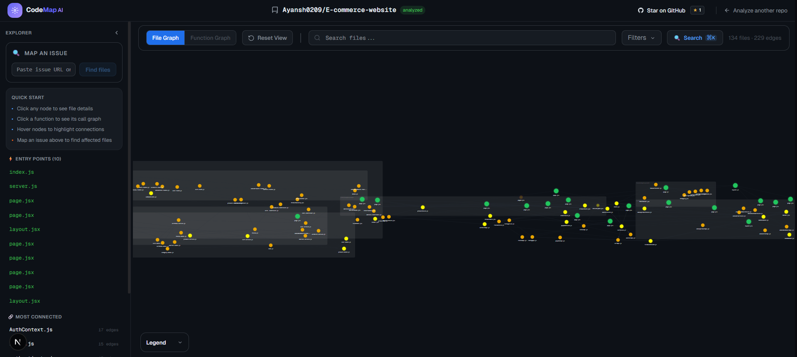
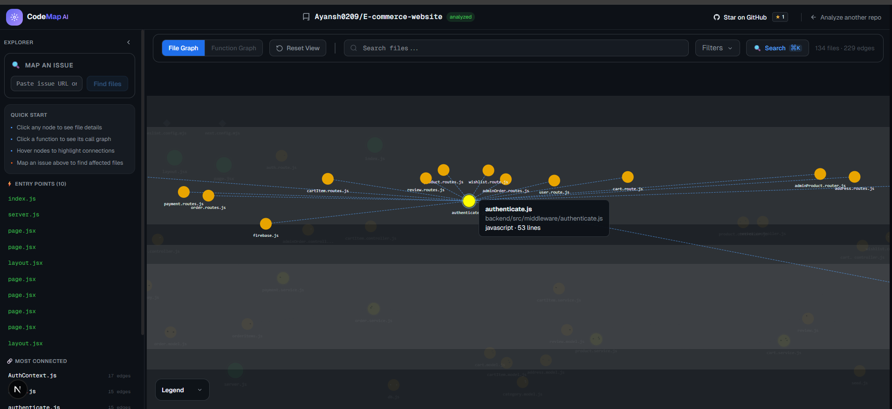
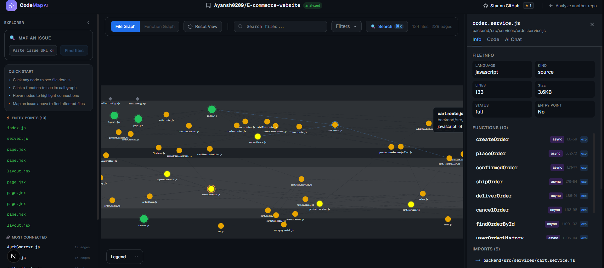

# CodeMap AI
A friendly, deterministic map for open source newcomers.

CodeMap AI helps you understand a large codebase fast so you can contribute confidently instead of getting lost in the repo. The parsing engine is 100% deterministic and does not use AI to infer structure. AI is only used to explain results and help you reason about issues based on the real, parsed graph.

> Note: I may change the name in the future or you can suggest a good name

## What it does

You paste a GitHub repo URL and get an interactive map(graph) of that codebase: real file dependencies, function-level call graphs, and a clear architectural overview. The core parser uses the TypeScript compiler API (ts-morph) to extract import relationships and function call chains without hallucination.
### Visual Preview

Here’s a sneak peek at what CodeMap AI gives you:


*Visualizing real file dependencies in a large codebase.*


*See which functions call which, with direct links to the code.*


*Map GitHub issues to the files that matter most for a fix.*

## Key features

- File dependency graph with real import edges
- Function-level call graph with direct GitHub line links
- Issue mapper that maps a GitHub issue to the most relevant files, so you can search an issue and see which files might need changes
- AI chat grounded in actual file content and issue context
- Dead code detection, circular dependency detection, and architectural importance scoring


## What has been done so far

- Deterministic graph extraction for JS/TS (including JSX/TSX)
- GitHub tarball download and safe extraction
- Redis-backed caching and queue processing
- Issue mapping with deterministic results plus optional AI augmentation
- Frontend UI for graph exploration and chat

## How it works (short version)

1. Backend downloads the GitHub repo tarball and extracts it locally.
2. The parser builds normalized graphs from the real source tree.
3. Results are cached in Redis and served via API endpoints.
4. The frontend renders file and function graphs with search and filters.
5. AI adds explanation and issue analysis on top of the real data.

## Project structure

- backend: Express API, parser, queue worker, Redis cache
- frontend: Next.js UI for graphs, issue mapping, and chat

## Getting started

### Prerequisites

- Node.js 18+ (recommended)
- Redis (local or hosted)
- GitHub Personal Access Token (for repo download)

### Install

```bash
# backend
cd backend
npm install

# frontend
cd ../frontend
npm install
```

### Configure environment

Create backend/.env with the variables below.

### Run locally

In separate terminals:

```bash
# terminal 1: backend API
cd backend
npm run dev
```

```bash
# terminal 2: background worker
cd backend
npm run worker
```

```bash
# terminal 3: frontend
cd frontend
npm run dev
```

Frontend: http://localhost:3000
Backend: http://localhost:5000

## Configuration

All config lives in backend/.env.

Required:

- REDIS_URL: Redis connection string
- GITHUB_TOKEN: GitHub token used for tarball downloads
- PORT: API server port (default: 5000)
- MAX_CONCURRENT_JOBS: worker concurrency (default: 3)
- MAX_QUEUE_SIZE: queue backpressure limit (default: 100)
- JOB_TIMEOUT_MS: per-job timeout in ms (default: 600000)
- GEMINI_API_KEY: enables AI issue mapping and chat
- R2_ACCOUNT_ID, R2_ACCESS_KEY_ID, R2_SECRET_ACCESS_KEY, R2_BUCKET_NAME, R2_PUBLIC_URL: reserved for future object storage support

## Current language support

- JavaScript and TypeScript, including JSX and TSX
- CommonJS and ES modules

## Future feature 

- Python support via tree-sitter adapter
- Go, Rust, and C++ adapters with the same normalized graph schema
- Monorepo workspace-aware import resolution across package boundaries
- Folder-first view for repositories with more than 400 files
- Pull request creation directly from the issue mapper workflow
- GitHub OAuth for private repository support
- VS Code extension for navigating the graph from inside the editor

## Contributing

See CONTRIBUTING.md if you want to help make this project better and more useful
